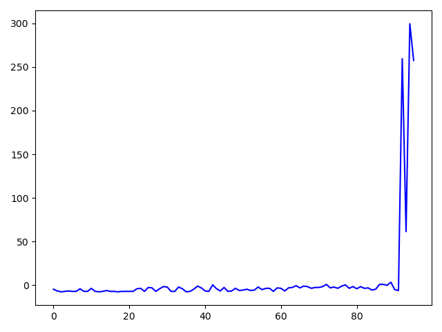

# Unreal Reinforcement

## [Demo youtube](https://www.youtube.com/watch?v=9NzTpVfRoCg)
  
## Reward
세로 축: Reward  
가로 축: Episode   
  
  
학습 후 어느 정도가 지나면 끝이 나지 않게 되어서 Reward가 급격히 상승한다.  
## Version
### [C++(Recommend)](https://github.com/SHSongs/UnrealReinforcement/tree/cpp)  
### [Blueprint](https://github.com/SHSongs/UnrealReinforcement/tree/blueprint)

## Tech
- DQN  
- Socket  
- Game  
## Dependencies
### Python3
- PyTorch
- Socket
### Unreal Engine 4.25
- [UE4TcpSocketPlugin](https://unrealengine.com/marketplace/en-US/product/tcp-socket-plugin)