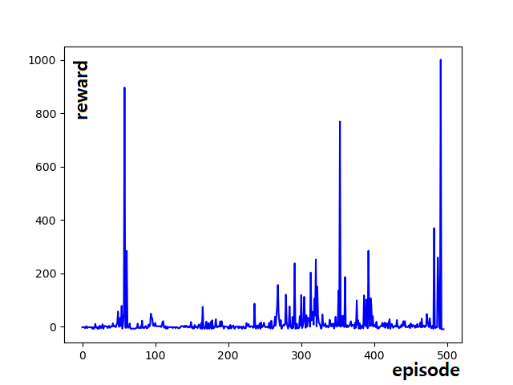

*Do you want a RL agent moving on Unreal Engine?*

# Unreal Reinforcement

This is a DQN Algorithm with Unreal Engine, Python.  

Please feel free to open an issue or a pull-request if you have any idea to make it better. :)


## Prerequisites
This repository is tested ...
```
- Windows 10
- Visual Studio 2019

- Unreal Engine 4.25
- UE4 tcp socket plugin (https://unrealengine.com/marketplace/en-US/product/tcp-socket-plugin)

- Python 3.6
- Pytorch 1.7.1
```
> We plan to shipment the game

## How to use
1. Open URGame/URGame.uproject
2. Run Python Train.py
3. Start URGame
   
## [Demo youtube](https://www.youtube.com/watch?v=9NzTpVfRoCg)
  
## Reward
stack state = 1  
  

stack state = 4  
  

## Version
### [C++(Recommend)](https://github.com/SHSongs/UnrealReinforcement/tree/cpp)  
### [Blueprint](https://github.com/SHSongs/UnrealReinforcement/tree/blueprint)

